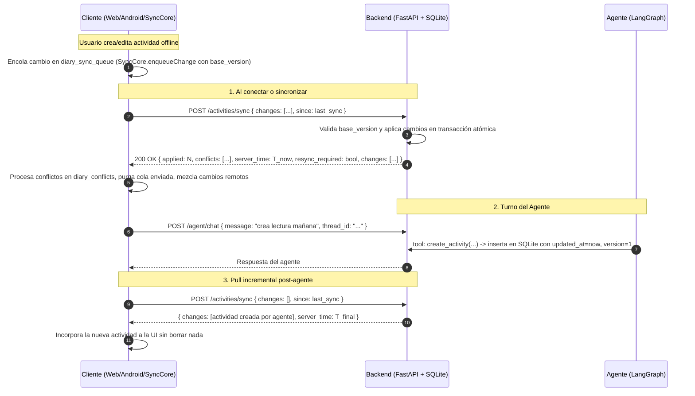

# Modelo de Sincronización de Datos (App-Agenda)

## 1. Principio Fundamental
* **Servidor (SQLite / FastAPI) como Fuente Canónica y Autoridad:** La base de datos central actúa como la autoridad canónica para la asignación monotónica de revisiones (`version`) y marcas de tiempo UTC (`updated_at`).
* **Cliente Autónomo (Modo Standalone / Offline):** Si no hay backend conectado, el cliente opera con `localStorage` y encola las mutaciones en `diary_sync_queue` preservando el `base_version` original.

---

## 2. Esquema de Registro y Versionado

Cada actividad contiene los siguientes metadatos de sincronización:

| Campo | Tipo | Descripción |
|---|---|---|
| `id` | `TEXT` (UUID) | Identificador único (`crypto.randomUUID()` o UUIDv4 de 36 caracteres). Los IDs existentes se preservan sin renombrar. |
| `user_id` | `TEXT` | Identificador del usuario propietario. |
| `title`, `date`, `startTime`, `endTime`, `priority`, `tags`, `completed` | Varios | Campos funcionales de la actividad. |
| `updated_at` | `TEXT` (ISO 8601 UTC) | Marca de tiempo autoritativa de la última modificación (`YYYY-MM-DDTHH:MM:SS.ffffffZ`). |
| `deleted_at` | `TEXT` (ISO 8601 UTC o `NULL`) | **Tombstone**: si es no nulo, indica que la actividad fue eliminada. |
| `version` | `INTEGER` | Contador monotónico de revisiones del registro (inicia en 1). |

---

## 3. Flujo de Sincronización Incremental

---

## 4. Resolución de Conflictos y Autoridad del Servidor

1. **Requisito de `base_version`:**
   - **Registro Existente:** Toda actualización enviada sobre un ID que ya existe en el servidor **DEBE incluir `base_version`**. Si no se envía, el servidor la rechaza como conflicto (`reason: "missing_base_version"`) y **nunca sobrescribe a ciegas**.
   - **Registro Nuevo:** Un ID nuevo no requiere `base_version` y se crea en `version = 1`.
2. **Conflicto de Versión (`version_stale`):**
   - Si `base_version < server_version`, el servidor rechaza el cambio y devuelve el registro del servidor.
   - El cliente guarda la edición local en `diary_conflicts` (sin pérdida silenciosa) y permite al usuario **Rebasar** (`rebaseConflictChange` asigna la nueva `base_version` y re-encola) o **Aceptar servidor** (`discardConflictChange`).
3. **Inmunidad a Relojes Locales:**
   - El orden cronológico y de versión lo determina el servidor de forma monotónica. Un cliente con reloj adelantado no puede ganar conflictos con versiones obsoletas.
4. **Tombstones (Borrados Lógicos):**
   - Una eliminación asigna `deleted_at: timestamp_utc` e incrementa la versión.
   - `list_activities`, `get_stats`, `find_free_slots`, búsqueda, calendario y alarmas excluyen automáticamente registros con `deleted_at IS NOT NULL`.
   - `update_activity` y `mark_done` sobre un tombstone retornan un error explícito.
5. **Purga de Tombstones y `resync_required`:**
   - Los tombstones se purgan físicamente tras **30 días** (`purge_tombstones`), ejecutándose al arranque y periódicamente.
   - Si un cliente solicita sincronización con un timestamp `since` anterior a los 30 días, el servidor devuelve `resync_required: true`. El cliente reemplaza su estado con el pull canónico pero **retiene y mezcla sus cambios pendientes locales**.

---

## 5. Garantías de Resiliencia, Backups e Importación

* **Transacciones Atómicas:** No existe borrado masivo (`DELETE FROM activities`). Toda sincronización se realiza dentro de transacciones SQLite seguras con timeout y reintentos.
* **Copia Permanente Pre-Migración:** Solo cuando se detecta una migración de esquema real necesaria, se genera una copia inmutable `backend/backups/pre_migration_<name>_<timestamp>.db` que **nunca se elimina en la rotación**.
* **Rotación de Backups Automáticos:** Los respaldos periódicos `auto_<name>_backup_<timestamp>.db` rotan conservando únicamente los últimos 5 archivos.
* **Importación JSON Segura:**
  - Valida estructura, tipos, formato de fechas (YYYY-MM-DD), horas (HH:MM) y límite de 5 MB con `validateImportPayload`.
  - Genera automáticamente un snapshot de respaldo en `localStorage` (conservando solo los últimos 2 snapshots y manejando excepciones de cuota).
  - Previene resucitar tombstones o degradar versiones existentes.
  - Reporta resumen detallado: *X importadas, Y omitidas (borradas), Z no degradadas*.
* **Deprecación de `PUT /activities`:** El endpoint `PUT /activities` ha sido adaptado para utilizar `sync_changes` respetando `base_version`. Al estar 100% reemplazado por `POST /activities/sync` en el cliente, se recomienda su eliminación en la siguiente fase de limpieza.
