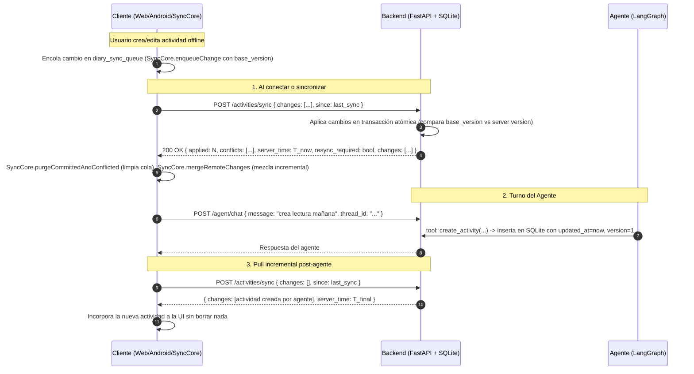

# Modelo de Sincronización de Datos (App-Agenda)

## 1. Principio Fundamental
* **Servidor (SQLite / FastAPI) como Fuente Canónica y Autoridad:** Cuando hay conexión con el backend, la base de datos central actúa como la autoridad canónica para la asignación monotónica de versiones (`version`) y timestamps UTC (`updated_at`).
* **Cliente Autónomo (Modo Standalone / Offline):** Si no hay backend configurado o el cliente pierde conexión, opera con `localStorage` de manera ininterrumpida y encola las mutaciones en `diary_sync_queue` preservando el `base_version` original.

---

## 2. Esquema de Registro y Versionado

Cada actividad contiene los siguientes metadatos de sincronización:

| Campo | Tipo | Descripción |
|---|---|---|
| `id` | `TEXT` (UUID) | Identificador único (`crypto.randomUUID()` o UUIDv4 de 36 caracteres). Los IDs existentes se preservan sin renombrar. |
| `user_id` | `TEXT` | Identificador del usuario propietario. |
| `title`, `date`, `startTime`, `endTime`, `priority`, `tags`, `completed` | Varios | Campos funcionales de la actividad. |
| `updated_at` | `TEXT` (ISO 8601 UTC) | Marca de tiempo autoritativa de la última modificación (`YYYY-MM-DDTHH:MM:SS.ffffffZ`). |
| `deleted_at` | `TEXT` (ISO 8601 UTC o `NULL`) | **Tombstone**: si es no nulo, indica que la actividad fue eliminada. |
| `version` | `INTEGER` | Contador monotónico de revisiones del registro (inicia en 1). |

---

## 3. Flujo de Sincronización Incremental

---

## 4. Resolución de Conflictos y Autoridad del Servidor

1. **Autoridad de Versión:** El cliente envía `base_version` (la versión que tenía al momento de editar). Si en el servidor la actividad ya tiene una versión superior (`existing.version > base_version`), el servidor **rechaza la sobrescritura**, marca un conflicto en `conflicts: [{ id, server_version, reason: 'version_stale' }]` y envía el estado actual del servidor para que el cliente lo adopte.
2. **Inmunidad a Relojes del Cliente:** Incluso si un cliente tiene su reloj adelantado 1 día, no puede ganar un conflicto si su `base_version` es obsoleta.
3. **Tombstones (Borrados Lógicos):**
   - Una eliminación asigna `deleted_at: timestamp_utc` e incrementa la versión.
   - Las herramientas del agente (`list_activities`, `get_stats`, `find_free_slots`), los endpoints de lectura y las vistas de la UI excluyen automáticamente registros con `deleted_at IS NOT NULL`.
   - `update_activity` y `mark_done` sobre una actividad con tombstone retornan un error explícito.
4. **Purga de Tombstones y `resync_required`:**
   - Los tombstones se purgan físicamente tras **30 días** (`purge_tombstones`).
   - Si un cliente solicita sincronización con un timestamp `since` anterior a la ventana de retención (30 días), el servidor devuelve `resync_required: true` y la lista completa de actividades activas para realizar un **full pull** limpio.

---

## 5. Garantías de Resiliencia y No Pérdida de Datos

* **Transacciones Atómicas:** No existe borrado masivo (`DELETE FROM activities`). Toda sincronización se realiza dentro de transacciones SQLite seguras con timeout y reintentos.
* **Rotación Automática de Backups:** Antes de migraciones o inicializaciones, el backend guarda una copia de seguridad en `backend/backups/agenda_backup_YYYYMMDD_HHMMSS.db`, conservando automáticamente las últimas 5 copias.
* **Importación Segura de Backups en Cliente:**
  - Requiere confirmación explícita del usuario.
  - Genera automáticamente un snapshot de respaldo en `localStorage` antes de aplicar la importación.
  - Pasa a través de `SyncCore.prepareImportChanges`, preservando la consistencia y encolando cambios para el servidor sin borrar datos masivamente.
* **Resiliencia ante Fallos de Red:** Si una llamada de red falla durante el sync, la cola `diary_sync_queue` se mantiene intacta en el cliente para el siguiente reintento idempotente.
