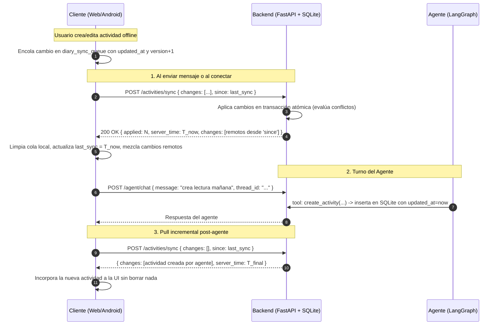

# Modelo de Sincronización de Datos (App-Agenda)

## 1. Principio Fundamental
* **Servidor (SQLite / Postgres) como Fuente de Verdad:** Cuando hay conexión con el backend de FastAPI, la base de datos central actúa como la autoridad canónica para todas las actividades.
* **Cliente Autónomo (Modo Standalone / Offline):** Si no hay backend configurado o el cliente pierde conexión, opera con `localStorage` de manera ininterrumpida y encola las mutaciones en `diary_sync_queue`.

---

## 2. Esquema de Registro y Versionado

Cada actividad contiene los siguientes metadatos de sincronización:

| Campo | Tipo | Descripción |
|---|---|---|
| `id` | `TEXT` (UUID) | Identificador único (`crypto.randomUUID()` o UUIDv4 de 36 caracteres). Los IDs existentes se preservan sin renombrar. |
| `user_id` | `TEXT` | Identificador del usuario propietario. |
| `title`, `date`, `startTime`, `endTime`, `priority`, `tags`, `completed` | Varios | Campos funcionales de la actividad. |
| `updated_at` | `TEXT` (ISO 8601 UTC) | Marca de tiempo precisa de la última modificación (`YYYY-MM-DDTHH:MM:SS.ffffffZ`). |
| `deleted_at` | `TEXT` (ISO 8601 UTC o `NULL`) | **Tombstone**: si es no nulo, indica que la actividad fue eliminada. |
| `version` | `INTEGER` | Contador monotónico de revisiones del registro (inicia en 1). |

---

## 3. Flujo de Sincronización Incremental

---

## 4. Resolución de Conflictos (LWW con Versionado)

Cuando dos clientes o el agente modifican la misma actividad concurrentemente:
1. Si `remote.updated_at > local.updated_at`: El cambio más reciente prevalece.
2. Si un registro entrante tiene una versión o timestamp inferior al que ya reside en el servidor, el servidor no lo sobreescribe y devuelve el registro actual en la lista de `conflicts` para que el cliente lo adopte.
3. Los borrados son lógicos (**tombstones**): una actividad eliminada envía `deleted_at: timestamp`. El cliente y el servidor la retiran de las vistas activas, pero el registro se propaga para eliminarla de todos los dispositivos sincronizados.

---

## 5. Garantías de No Pérdida de Datos
* **Transacciones Atómicas:** Se eliminó el método destructivo `DELETE FROM activities`. Toda sincronización se realiza dentro de transacciones SQLite seguras (`BEGIN` / `COMMIT`).
* **Backups Automáticos:** Antes de aplicar cualquier migración de esquema en el backend, el sistema crea automáticamente una copia timestamped: `backend/agenda.db_backup_YYYYMMDD_HHMMSS.db`.
* **Exportación en Cliente:** El usuario puede exportar en cualquier momento un archivo `mi-diario-backup-YYYY-MM-DD.json` desde la pestaña Ajustes.
